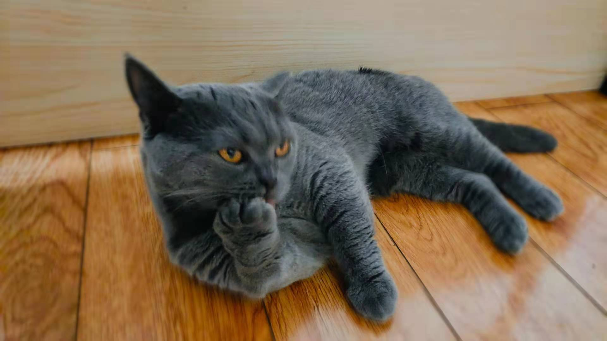

### Hi there 👋 

- 💻 I’m currently working on fullstack
- 🌱 I’m currently learning java and swift

**look at my lovely cat!** 😊

## Some of my Github Stats

- 😄 my blog: https://elsaooo.github.io/
- 😄 ZhiHu: https://www.zhihu.com/people/sheng-hua-gu/posts
- 😎 open source project which I was involved: https://gitee.com/devui/vue-devui
<!--
**ElsaOOo/ElsaOOo** is a ✨ _special_ ✨ repository because its `README.md` (this file) appears on your GitHub profile.

Here are some ideas to get you started:

- 🔭 I’m currently working on ...
- 🌱 I’m currently learning ...
- 👯 I’m looking to collaborate on ...
- 🤔 I’m looking for help with ...
- 💬 Ask me about ...
- 📫 How to reach me: ...
- 😄 Pronouns: ...
- ⚡ Fun fact: ...
  -->
